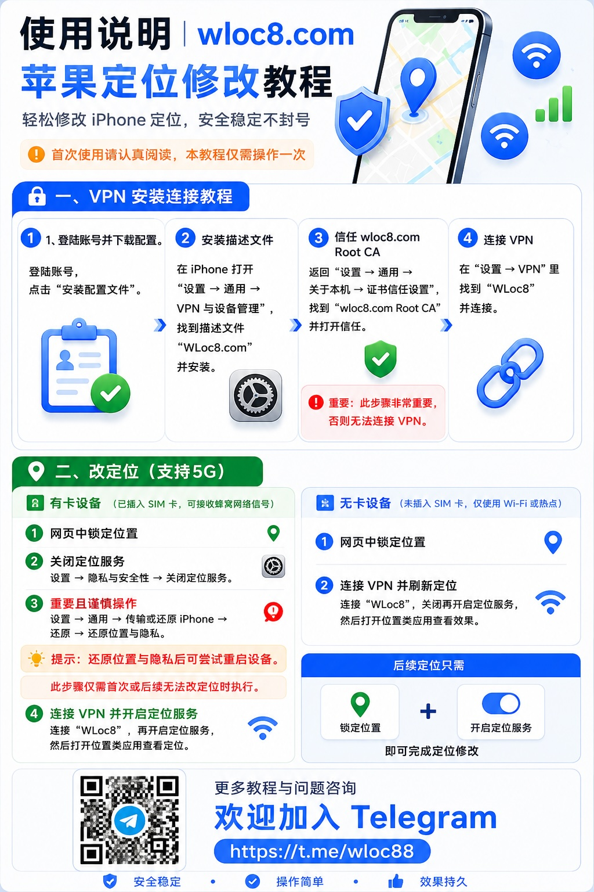
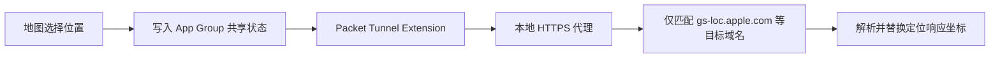

<p align="center">
  
</p>

<h1 align="center">OpenHRTT WLoc</h1>

<p>在线体验：<a href="https://wloc8.com/" target="_blank">https://wloc8.com/</a>，TG群：https://t.me/wloc88</p>


<p align="center">
  <a href="https://t.me/wloc88/8">
    
  </a>
</p>

<p align="center">点击图片可查看最新使用教程</p>

<p align="center">
  面向 iOS 和 macOS 的实验性定位响应研究工具
</p>

<p align="center">
  <a href="README_EN.md">English</a> |
  <a href="CONTRIBUTING.md">贡献指南</a> |
  <a href="SECURITY.md">安全说明</a>
</p>

## 项目介绍

OpenHRTT WLoc 是一个 完全开源使用 Swift 编写的 iOS/macOS 实验性工具。用户可以在地图上搜索或选择坐标，应用通过 Packet Tunnel 和只匹配指定 Apple 定位服务域名的本地 HTTPS 代理，在设备内部处理定位响应数据。

项目目前包含：

- iOS 和 macOS 应用目标。
- iOS 和 macOS Packet Tunnel Extension。
- 地图搜索、点选、收藏和快速恢复。
- WGS84、GCJ-02、BD-09 与 Apple Map 坐标转换。
- `wlocapp://` 外部链接导入。
- 根证书本机下载服务。

## 工作原理



代理目前只针对 `gs-loc.apple.com` 和 `gs-loc-cn.apple.com`，不应被当作通用 VPN 或通用 HTTPS 抓包工具。

## 环境要求

- macOS 开发环境。
- Xcode 16 或更高版本；当前已在 Xcode 26.6 下检查。
- CocoaPods 1.16 或更高版本。
- OpenSSL 3.x。
- 需要 Network Extensions 能力的 Apple Developer 开发者账号。
- 真机运行才能完整验证证书信任、VPN 和系统定位行为。

工程声明的最低版本为 iOS 12.0 和 macOS 10.11，但较旧系统尚未进行完整回归测试。

## 快速开始

### 1. 获取代码并安装依赖

```bash
git clone https://github.com/OpenHRTT/wloc.git
cd wloc
pod install
```

后续请始终打开 `WLocApp.xcworkspace`，不要直接打开 `WLocApp.xcodeproj`。

### 2. 生成你自己的本地证书

仓库不包含任何可重用的根证书私钥或 `.p12` 文件。每个开发者都必须在本机生成独立证书：

```bash
chmod +x generate_apple_wloc_p12.sh
./generate_apple_wloc_p12.sh
```

脚本会生成证书并自动同步到 App/Extension 资源目录。默认 `.p12` 密码为 `app-wloc`，与 `AppWLocConfig.proxyIdentityPassword` 一致。如果你修改脚本密码，也必须同步修改应用配置。

> [!IMPORTANT]
> `app_wloc_certs/`、`*.key`、`*.p12` 和生成到 `Resources` 中的证书文件已被 `.gitignore` 排除。不要使用 `git add -f` 强制提交它们。

### 3. 配置签名和唯一标识

用 Xcode 打开 `WLocApp.xcworkspace`，对以下四个 Target 选择你自己的 Team：

- `WLocApp-iOS`
- `WLocTunnel-iOS`
- `WLocApp-macOS`
- `WLocTunnel-macOS`

然后修改 Bundle Identifier，并保证 Tunnel 的标识为应用标识加 `.tunnel`。例如：

```text
com.example.wloc
com.example.wloc.tunnel
```

项目还使用 App Group。请将下列文件中的 `group.com.wlocapp.shared` 统一替换为你的 App Group：

- `Resources/iOS/WLocApp-iOS.entitlements`
- `Resources/Tunnel/WLocTunnel-iOS.entitlements`
- `Resources/macOS/WLocApp-macOS.entitlements`
- `Resources/Tunnel/WLocTunnel-macOS.entitlements`
- `WLocApp/WLocCore/AppWLocConfig.swift`

在 Signing & Capabilities 中确认 App Groups 和 Network Extensions 已正确启用。

### 4. 构建和运行

在 Xcode 顶部选择 `WLocApp-iOS` 或 `WLocApp-macOS` Scheme，选择你的真机，然后点击 Run。

## 使用方法

### iOS

1. 打开 App，进入“教程”页并点击“下载证书”。
2. 在 Safari 中下载根证书。
3. 前往“设置 -> 通用 -> VPN 与设备管理”安装证书。
4. 前往“设置 -> 通用 -> 关于本机 -> 证书信任设置”，手动完全信任该根证书。
5. 回到地图页，搜索地点或点击地图选择位置。
6. 点击“锁定位置”，允许系统添加 VPN 配置。
7. 按 App 内提示刷新系统定位服务。
8. 退出 App 后会尝试断开 VPN 并清除锁定状态。

### macOS

1. 在 App 教程中下载根证书。
2. 将证书导入“钥匙串访问”，并仅在测试期间设置为“始终信任”。
3. 在地图中选择位置并点击“锁定位置”。
4. 允许系统创建 VPN/Network Extension 配置。
5. 测试完成后断开 VPN，并在不再需要时删除根证书。

## 外部链接

应用支持通过 `wlocapp://` 导入位置。载荷是 URL 编码后的 JSON：

```json
{
  "type": "location",
  "data": {
    "name": "Tiananmen Square",
    "detail": "Beijing",
    "latitude": 39.9087,
    "longitude": 116.3975,
    "coordinateSystem": "wgs84"
  }
}
```

支持的 `coordinateSystem` 值包括 `wgs84`、`gcj02`、`bd09` 和 `apple`。完整 URL 可以使用两种格式：

```text
wlocapp://<percent-encoded-json>
wlocapp://?payload=<percent-encoded-json>
```

## 项目结构

```text
WLocApp/
├── Resources/                 # Info.plist、entitlements、图标和本地生成资源
├── WLocApp/
│   ├── LiquidGlassKit/         # iOS Metal 玻璃效果（第三方版权）
│   ├── WLocCore/              # 共享状态、代理、坐标转换、VPN 管理
│   ├── WLocAppShared/         # 证书下载和 URL Scheme
│   ├── WLocAppiOS/            # iOS 界面
│   └── WLocAppMac/            # macOS 界面
├── WLocApp.xcodeproj/
├── WLocApp.xcworkspace/
├── Podfile
└── generate_apple_wloc_p12.sh
```

Xcode 工程当前引用的主代码位于 `WLocApp/` 子目录。仓库根目录下同名的历史源码目录不在当前 Target 中，请不要在两处同时修改。

## 安全和隐私

- 每个开发者必须使用自己生成的独立根证书，禁止分享根证书私钥或 `.p12`。
- 不再使用时，请从系统中删除 VPN 配置和受信任的根证书。
- 代理只应处理明确列入 `AppWLocConfig.appWLocHosts` 的域名。
- 不要在 Issue、日志或截图中发布私钥、证书、开发者凭据或个人位置数据。
- 发现安全问题时，请按 [SECURITY.md](SECURITY.md) 私下报告。

## 常见问题

**Xcode 提示找不到 SnapKit/SwiftProtobuf/GCDWebServer？**

运行 `pod install`，然后关闭 `.xcodeproj`，改为打开 `WLocApp.xcworkspace`。

**构建时提示找不到 `AppWLocProxy.p12` 或 `AppWLocRootCA.cer`？**

在项目根目录运行 `./generate_apple_wloc_p12.sh`。

**Signing 或 App Group 报错？**

确认四个 Target 都选择了你的 Team，Bundle Identifier 全部唯一，并且 App 与 Tunnel 使用同一个 App Group。

**点击锁定后没有生效？**

检查根证书是否已安装且完全信任、VPN 是否已连接、Tunnel Bundle Identifier 是否与主 App 匹配，然后按 App 提示刷新定位服务。

更多排查步骤见 [docs/TROUBLESHOOTING.md](docs/TROUBLESHOOTING.md)。

## 贡献

欢迎提交 Issue 和 Pull Request。请先阅读 [CONTRIBUTING.md](CONTRIBUTING.md) 和 [CODE_OF_CONDUCT.md](CODE_OF_CONDUCT.md)。

## 第三方依赖

项目使用 SwiftProtobuf、SnapKit、IQKeyboardManagerSwift、GCDWebServer 和仓库内的 LiquidGlassKit。详细版本、来源与授权状态见 [THIRD_PARTY_NOTICES.md](THIRD_PARTY_NOTICES.md)。

## 许可证

本项目自有代码使用 [MIT License](LICENSE)。第三方代码不受本项目 MIT License 覆盖，具体见 [NOTICE](NOTICE) 和 [THIRD_PARTY_NOTICES.md](THIRD_PARTY_NOTICES.md)。
