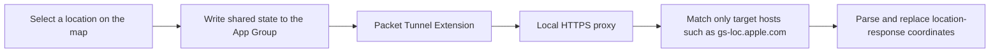

<p align="center">
  
</p>

<h1 align="center">OpenHRTT WLoc</h1>

<p>Online access: <a href="https://wloc8.com/">https://wloc8.com/</a>. Telegram group: https://t.me/wloc88</p>

<a href="https://t.me/wloc88/8">Usage tutorial &gt;&gt;&gt;</a>

<p align="center">
  An experimental location-response research tool for iOS and macOS
</p>

<p align="center">
  <a href="README.md">中文</a> |
  <a href="CONTRIBUTING.md">Contributing</a> |
  <a href="SECURITY.md">Security</a>
</p>

## About

OpenHRTT WLoc is a fully open-source experimental iOS/macOS project written in Swift. Users can search for or select a coordinate on a map. The app stores the selected location in a shared App Group and uses a Packet Tunnel together with a narrowly scoped local HTTPS proxy to process location responses on the device.

The project currently includes:

- iOS and macOS app targets.
- iOS and macOS Packet Tunnel extensions.
- Map search, coordinate selection, favorites, and quick restoration.
- WGS84, GCJ-02, BD-09, and Apple Map coordinate conversion.
- `wlocapp://` deep-link import.
- A local root-certificate download service.

## How it works



The proxy currently targets only `gs-loc.apple.com` and `gs-loc-cn.apple.com`. It must not be treated as a general-purpose VPN or HTTPS interception tool.

## Requirements

- A macOS development environment.
- Xcode 16 or newer; the project has currently been checked with Xcode 26.6.
- CocoaPods 1.16 or newer.
- OpenSSL 3.x.
- An Apple Developer account with the ability to sign Network Extensions.
- A physical device for complete certificate-trust, VPN, and system-location testing.

The project declares minimum deployment targets of iOS 12.0 and macOS 10.11, but older operating systems have not undergone complete regression testing.

## Quick start

### 1. Get the code and install dependencies

```bash
git clone https://github.com/OpenHRTT/wloc.git
cd wloc
pod install
```

From this point onward, always open `WLocApp.xcworkspace` instead of `WLocApp.xcodeproj`.

### 2. Generate your own local certificates

The repository does not include any reusable root-certificate private key or `.p12` file. Every developer must generate an independent set of certificates locally:

```bash
chmod +x generate_apple_wloc_p12.sh
./generate_apple_wloc_p12.sh
```

The script generates the certificates and automatically copies them into the App and Extension resource directories. The default `.p12` password is `app-wloc`, matching `AppWLocConfig.proxyIdentityPassword`. If you change the password in the script, update the app configuration as well.

> [!IMPORTANT]
> `app_wloc_certs/`, `*.key`, `*.p12`, and the generated certificate files under `Resources` are excluded by `.gitignore`. Never force-add them with `git add -f`.

### 3. Configure signing and unique identifiers

Open `WLocApp.xcworkspace` in Xcode and select your own Team for all four targets:

- `WLocApp-iOS`
- `WLocTunnel-iOS`
- `WLocApp-macOS`
- `WLocTunnel-macOS`

Change the Bundle Identifiers, making sure that the Tunnel identifier is the app identifier followed by `.tunnel`. For example:

```text
com.example.wloc
com.example.wloc.tunnel
```

The project also uses an App Group. Replace `group.com.wlocapp.shared` consistently in the following files with your own App Group:

- `Resources/iOS/WLocApp-iOS.entitlements`
- `Resources/Tunnel/WLocTunnel-iOS.entitlements`
- `Resources/macOS/WLocApp-macOS.entitlements`
- `Resources/Tunnel/WLocTunnel-macOS.entitlements`
- `WLocApp/WLocCore/AppWLocConfig.swift`

Under Signing & Capabilities, confirm that App Groups and Network Extensions are correctly enabled.

### 4. Build and run

At the top of Xcode, select the `WLocApp-iOS` or `WLocApp-macOS` scheme, choose your physical device, and click Run.

## Usage

<p align="center">
  <a href="https://t.me/wloc88/8">
    
  </a>
</p>

<p align="center">Click the image to view the latest usage tutorial</p>

### iOS

1. Open the app, go to the Tutorial page, and tap Download Certificate.
2. Download the root certificate in Safari.
3. Go to Settings → General → VPN & Device Management and install the certificate.
4. Go to Settings → General → About → Certificate Trust Settings and manually enable full trust for the root certificate.
5. Return to the map, search for a place or tap the map to select a location.
6. Tap Lock Location and allow the system to add the VPN configuration.
7. Refresh system Location Services as instructed by the app.
8. When the app exits, it attempts to disconnect the VPN and clear the locked state.

### macOS

1. Download the root certificate from the app's Tutorial page.
2. Import the certificate into Keychain Access and set it to Always Trust only while testing.
3. Select a location on the map and click Lock Location.
4. Allow the system to create the VPN/Network Extension configuration.
5. Disconnect the VPN after testing and remove the root certificate when it is no longer needed.

## External links

The app supports importing locations through `wlocapp://`. The payload is URL-encoded JSON:

```json
{
  "type": "location",
  "data": {
    "name": "Tiananmen Square",
    "detail": "Beijing",
    "latitude": 39.9087,
    "longitude": 116.3975,
    "coordinateSystem": "wgs84"
  }
}
```

Supported `coordinateSystem` values are `wgs84`, `gcj02`, `bd09`, and `apple`. A complete URL can use either of these formats:

```text
wlocapp://<percent-encoded-json>
wlocapp://?payload=<percent-encoded-json>
```

## Project structure

```text
WLocApp/
├── Resources/                 # Info.plist, entitlements, icons, and locally generated resources
├── WLocApp/
│   ├── LiquidGlassKit/        # Third-party iOS Metal glass effects
│   ├── WLocCore/              # Shared state, proxy, coordinate conversion, and VPN management
│   ├── WLocAppShared/         # Certificate download and URL Scheme support
│   ├── WLocAppiOS/            # iOS interface
│   └── WLocAppMac/            # macOS interface
├── WLocApp.xcodeproj/
├── WLocApp.xcworkspace/
├── Podfile
└── generate_apple_wloc_p12.sh
```

The source code referenced by the current Xcode project is under the `WLocApp/` subdirectory. A legacy source directory with the same name at the repository root is not included in the current targets; do not edit both locations simultaneously.

## Security and privacy

- Every developer must use independently generated root certificates. Never share a root-certificate private key or `.p12` file.
- Remove the VPN configuration and trusted root certificate from the system when they are no longer needed.
- The proxy should process only the hosts explicitly listed in `AppWLocConfig.appWLocHosts`.
- Do not post private keys, certificates, developer credentials, or personal location data in Issues, logs, or screenshots.
- Report security issues privately according to [SECURITY.md](SECURITY.md).

## FAQ

**Xcode cannot find SnapKit, SwiftProtobuf, or GCDWebServer. What should I do?**

Run `pod install`, close the `.xcodeproj`, and open `WLocApp.xcworkspace` instead.

**The build cannot find `AppWLocProxy.p12` or `AppWLocRootCA.cer`. What should I do?**

Run `./generate_apple_wloc_p12.sh` from the repository root.

**Signing or App Group configuration fails. What should I check?**

Make sure all four targets use your Team, every Bundle Identifier is unique, and the App and Tunnel use the same App Group.

**Lock Location does not take effect. What should I check?**

Confirm that the root certificate is installed and fully trusted, the VPN is connected, and the Tunnel Bundle Identifier matches the main app. Then refresh Location Services as instructed by the app.

For more diagnostic steps, see [Troubleshooting](docs/TROUBLESHOOTING.md).

## Contributing

Issues and pull requests are welcome. Please read [CONTRIBUTING.md](CONTRIBUTING.md) and [CODE_OF_CONDUCT.md](CODE_OF_CONDUCT.md) first.

## Third-party dependencies

The project uses SwiftProtobuf, SnapKit, IQKeyboardManagerSwift, GCDWebServer, and the bundled LiquidGlassKit. See [THIRD_PARTY_NOTICES.md](THIRD_PARTY_NOTICES.md) for versions, sources, and license information.

## License

Project-owned code is available under the [MIT License](LICENSE). Third-party code is not covered by the project's MIT License; see [NOTICE](NOTICE) and [THIRD_PARTY_NOTICES.md](THIRD_PARTY_NOTICES.md) for details.
