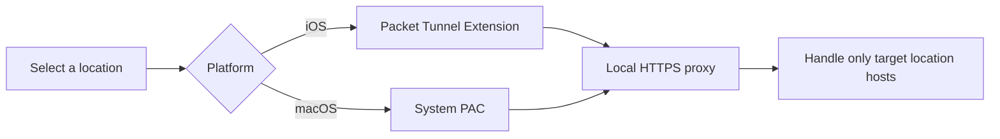

<h1>现急需Mac系统做兼容性测试，如你有Mac电脑，请联系：<br />开发者：https://t.me/wloc8</h1>

<p align="center">
  
</p>

<h1 align="center">OpenHRTT WLoc</h1>

<p>Online access: <a href="https://wloc8.com/">https://wloc8.com/</a>. Telegram group: https://t.me/wloc88</p>

<a href="https://t.me/wloc88/132">Usage tutorial &gt;&gt;&gt;</a>

<p align="center">
  An experimental location-response research tool for iOS and macOS
</p>

<p align="center">
  <a href="README.md">中文</a> |
  <a href="CONTRIBUTING.md">Contributing</a> |
  <a href="SECURITY.md">Security</a>
</p>

## About

OpenHRTT WLoc is a fully open-source experimental iOS/macOS project written in Swift. iOS uses a Packet Tunnel. The macOS validation build uses system PAC settings and sends only the selected Apple location hosts to a local HTTPS proxy running inside the main app.

## How it works



The proxy currently targets only `gs-loc.apple.com` and `gs-loc-cn.apple.com`. It must not be treated as a general-purpose VPN or HTTPS interception tool.

## Requirements

- A macOS development environment.
- Xcode 16 or newer; the project has currently been checked with Xcode 26.6.
- CocoaPods 1.16 or newer.
- OpenSSL 3.x.
- iOS requires Network Extension signing capability. macOS changes PAC through an embedded privileged helper and does not require Network/System Extension capability.
- A physical device for complete certificate-trust, VPN, and system-location testing.

The project declares minimum deployment targets of iOS 12.0 and macOS 13.0.

## Quick start

### 1. Get the code and install dependencies

```bash
git clone https://github.com/OpenHRTT/wloc.git
cd wloc
pod install
```

From this point onward, always open `WLocApp.xcworkspace` instead of `WLocApp.xcodeproj`.

When running the `WLocApp-macOS` scheme in Debug, its build post-action installs the signed app at `/Applications/WLoc8.com.app` and Xcode debugs that installed copy. The Xcode user needs write access to `/Applications`; set `WLOC_SKIP_DEBUG_INSTALL=1` when a build should skip installation.

### 2. Generate your own local certificates

The repository does not include any reusable root-certificate private key or `.p12` file. Every developer must generate an independent set of certificates locally:

```bash
chmod +x generate_apple_wloc_p12.sh
./generate_apple_wloc_p12.sh
```

The script generates the certificates and automatically copies them into the App and Extension resource directories. The default `.p12` password is `app-wloc`, matching `AppWLocConfig.proxyIdentityPassword`. If you change the password in the script, update the app configuration as well.

> [!IMPORTANT]
> `app_wloc_certs/`, `*.key`, `*.p12`, and the generated certificate files under `Resources` are excluded by `.gitignore`. Never force-add them with `git add -f`.

### 3. Configure signing and unique identifiers

Open `WLocApp.xcworkspace` in Xcode and select the same Team for all four targets:

- `WLocApp-iOS`
- `WLocTunnel-iOS`
- `WLocApp-macOS`
- `WLocPrivilegedHelper`

Change the Bundle Identifiers, making sure that the Tunnel identifier is the app identifier followed by `.tunnel`. For example:

```text
com.example.wloc
com.example.wloc.tunnel
```

The App Group is used only by the iOS app and Tunnel. Replace `group.com.wlocapp.shared` consistently in:

- `Resources/iOS/WLocApp-iOS.entitlements`
- `Resources/Tunnel/WLocTunnel-iOS.entitlements`
- `WLocApp/WLocCore/AppWLocConfig.swift`

Confirm App Groups and Network Extensions on the iOS targets. The macOS app and Helper must be signed by the same team; the app reads the Team ID from its current signature at runtime. Install the complete app in `/Applications` before running a distributed build.

### 4. macOS Developer ID signing

Users still see a single macOS `.app`; it embeds the signed `WLocPrivilegedHelper` and its LaunchDaemon configuration. Export a Developer ID app from Xcode Archive, then create the DMG:

```bash
cd /path/to/export-folder
/path/to/WLocApp/packaging/build_macos_dmg.sh
```

By default, the script reads `WLocApp-macOS.app` and `dmg-background.png` from the current directory and creates `WLoc8.com-{version}.dmg` there. Use `--app`, `--background`, and `--output` for custom paths, or `--build` to build before packaging.

Apps containing a LaunchDaemon must be notarized. After creating the DMG, submit it with `notarytool` and staple the notarization ticket with `stapler`. On first use, the user approves the background item once in System Settings; later lock and unlock operations do not repeatedly request an administrator password.


## External links （TODO）

The app supports importing locations through `wlocapp://`. The payload is URL-encoded JSON:

```json
{
  "type": "location",
  "data": {
    "name": "Tiananmen Square",
    "detail": "Beijing",
    "latitude": 39.9087,
    "longitude": 116.3975,
    "coordinateSystem": "wgs84"
  }
}
```

Supported `coordinateSystem` values are `wgs84`, `gcj02`, `bd09`, and `apple`. A complete URL can use either of these formats:

```text
wlocapp://<percent-encoded-json>
wlocapp://?payload=<percent-encoded-json>
```

## FAQ

**The build cannot find `AppWLocProxy.p12` or `AppWLocRootCA.cer`. What should I do?**

Run `./generate_apple_wloc_p12.sh` from the repository root.

**Signing or App Group configuration fails. What should I check?**

Make sure all four targets use the correct Team and the iOS App and Tunnel use the same App Group.

**Lock Location does not take effect. What should I check?**

Confirm that the root certificate is installed and fully trusted. On iOS, verify the VPN connection. On macOS, verify that Automatic Proxy Configuration points to the local PAC URL. Then refresh Location Services as instructed by the app.

For more diagnostic steps, see [Troubleshooting](docs/TROUBLESHOOTING.md).

## Contributing

Issues and pull requests are welcome. Please read [CONTRIBUTING.md](CONTRIBUTING.md) and [CODE_OF_CONDUCT.md](CODE_OF_CONDUCT.md) first.

## Third-party dependencies

The project uses SwiftProtobuf, SnapKit, IQKeyboardManagerSwift, and GCDWebServer. See [THIRD_PARTY_NOTICES.md](THIRD_PARTY_NOTICES.md) for versions, sources, and license information.

## License

Project-owned code is available under the [MIT License](LICENSE). Third-party code is not covered by the project's MIT License; see [NOTICE](NOTICE) and [THIRD_PARTY_NOTICES.md](THIRD_PARTY_NOTICES.md) for details.
