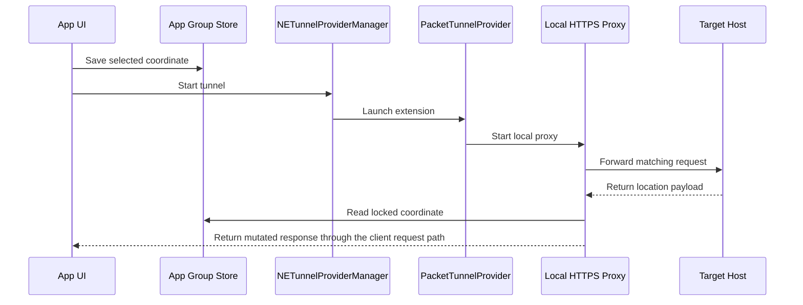

# 架构说明

## 目标组成

| Target | 作用 |
| --- | --- |
| `WLocApp-iOS` | UIKit 地图、搜索、收藏、证书下载和 VPN 控制 |
| `WLocTunnel-iOS` | iOS Packet Tunnel Extension 和本地 HTTPS 代理 |
| `WLocApp-macOS` | AppKit 地图、收藏、证书下载和 VPN 控制 |
| `WLocTunnel-macOS` | macOS Packet Tunnel Extension 和本地 HTTPS 代理 |

## 主要模块

- `AppWLocConfig`：域名、端口、App Group、证书资源和 Tunnel Identifier。
- `AppWLocStateStore`：通过 App Group `UserDefaults` 在主 App 和 Extension 之间共享锁定坐标。
- `AppWLocVPNManager`：创建、加载、启动和停止 `NETunnelProviderManager`。
- `PacketTunnelProvider`：设置虚拟网络、DNS 匹配和 HTTPS 代理。
- `AppWLocHTTPProxyServer`：接受目标请求、建立 TLS，转发并处理响应。
- `AppWLocMutator`：解析目标载荷，替换定位字段，保留未知 Protobuf 字段。
- `AppWLocCoordinateTool`：处理不同坐标系转换。
- `CertificateDownloadServer`：在局域网中临时提供根证书下载地址。

## 关键数据流

## 安全边界

- 根证书和代理身份由每个开发者本地生成，不进入 Git。
- 代理匹配域名受 `AppWLocConfig.appWLocHosts` 限制。
- Tunnel 排除默认路由，不用作通用全局 VPN。
- 锁定坐标保存在本地 App Group，当前没有远程服务器依赖。

任何放宽域名匹配、扩大路由范围、导出证书或引入远程控制的变更，都应被视为高风险安全变更。
