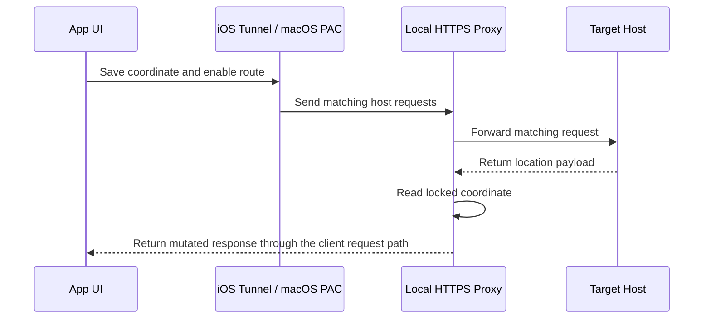

# 架构说明

## 目标组成

| Target | 作用 |
| --- | --- |
| `WLocApp-iOS` | UIKit 地图、搜索、收藏、证书下载和 VPN 控制 |
| `WLocTunnel-iOS` | iOS Packet Tunnel Extension 和本地 HTTPS 代理 |
| `WLocApp-macOS` | AppKit 地图、PAC 控制和应用内本地 HTTPS 代理 |
| `WLocPrivilegedHelper` | 以 root 身份执行受限的 `networksetup` PAC 修改 |

## 主要模块

- `AppWLocConfig`：域名、端口、App Group、证书资源和 Tunnel Identifier。
- `AppWLocStateStore`：iOS 通过 App Group 共享状态；macOS 使用主应用自己的 `UserDefaults`。
- `AppWLocVPNManager`：iOS 创建、加载、启动和停止 `NETunnelProviderManager`。
- `AppWLocPACManager`：macOS 启动本地代理和 PAC，通过安全 XPC 请求 Helper 修改并恢复系统 PAC。
- `AppWLocPrivilegedHelperProtocol`：定义 XPC 数据结构、Mach Service 名称和双向代码签名要求。
- `PacketTunnelProvider`：设置虚拟网络、DNS 匹配和 HTTPS 代理。
- `AppWLocHTTPProxyServer`：接受目标请求、建立 TLS，转发并处理响应。
- `AppWLocMutator`：解析目标载荷，替换定位字段，保留未知 Protobuf 字段。
- `AppWLocCoordinateTool`：处理不同坐标系转换。
- `CertificateDownloadServer`：在局域网中临时提供根证书下载地址。

## 关键数据流

## 安全边界

- 根证书和代理身份由每个开发者本地生成，不进入 Git。
- 代理匹配域名受 `AppWLocConfig.appWLocHosts` 限制。
- iOS Tunnel 排除默认路由；macOS PAC 对非目标域名返回 `DIRECT`。
- 锁定坐标只保存在本地；macOS 不再包含 Network/System Extension。
- macOS Helper 只接受签名匹配的主应用连接，主应用也验证 Helper 签名；XPC 只暴露 PAC 设置接口，不接受 shell 命令。

任何放宽域名匹配、扩大路由范围、导出证书或引入远程控制的变更，都应被视为高风险安全变更。
